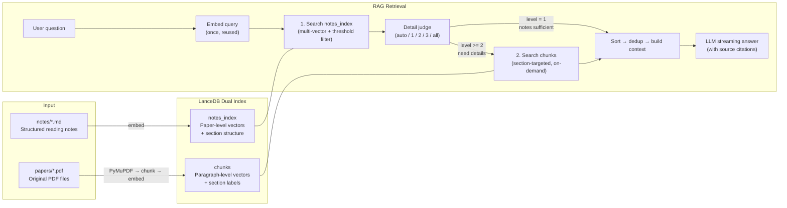

# Paper Vault

**Local paper reading assistant** — import PDFs, auto-generate structured notes, semantic search, adaptive RAG Q&A.

[](https://www.python.org/)
[](LICENSE)
[](README_zh.md)


---

## Why Paper Vault?

The most painful moments in academic research:

- **Read and forget**: can't recall the core formulas and methods from a paper you read three months ago
- **Paper silos**: each paper exists in isolation, with no automated way to connect them
- **Tool fragmentation**: PDFs in folders, notes in Obsidian, Q&A via ChatGPT — three disconnected workflows
- **No memory**: ChatGPT/Claude conversations lose all context when the session ends

Paper Vault solves all of this: **turn your PDFs into a queryable knowledge base, permanently stored and incrementally growing.**

### vs. ChatGPT / Claude / Claude Code

| | ChatGPT / Claude | Paper Vault |
|---|---|---|
| Paper library persistence | Lost after session | Permanent, continuously growing |
| Structured metadata | None | Title, authors, year, keywords |
| Batch processing | One paper at a time | Batch import, batch indexing |
| Data portability | Not exportable | Plain Markdown files, tool-agnostic |
| Reading notes | Manual prompting required | Auto-generated structured notes |
| Answer sourcing | Model memory / web search | Personal knowledge base retrieval, strict source tracing |
| API cost | Long context burns tokens | Retrieval + lightweight model, an order of magnitude cheaper |

Key differences:

- **Auto-generated notes, free your mind** — nothing breaks flow more than stopping to write notes while reading a paper. Paper Vault auto-generates structured notes on import (research question → method → implementation → results → formulas). You focus on reading; tweak the notes afterward. General AI tools require manual prompts every time, with inconsistent formatting and no persistence.
- **Knowledge-base RAG, not web search** — Claude Code and similar tools search the open web. Paper Vault's RAG retrieves from **your own paper library**. It's not for finding new things — it helps you **review, recall, and connect** papers you've already read. Every answer cites specific sources (which paper, which section), fully traceable.
- **Very low cost** — RAG constrains questions to retrieved paper excerpts, eliminating the need for massive context windows or complex reasoning. Lightweight models (e.g. DeepSeek-V4-Flash, GPT-4o-mini) work perfectly. A single Q&A costs a fraction of a cent, while general AI chat costs grow linearly with conversation length.

### vs. Obsidian / Notion

Paper Vault is **not a replacement for note-taking apps** — it fills the gap between them and paper reading:

| | Obsidian / Notion | Paper Vault |
|---|---|---|
| Paper note generation | Manual writing | Auto-generated structured notes |
| PDF handling | Plugins or external tools needed | Built-in PDF extraction + metadata detection |
| Semantic search | Relies on filenames/tags | 768-dim vector semantic search |
| AI integration | Requires plugin setup (e.g. Copilot), complex | Built-in RAG, works out of the box |
| Target use case | General note management | Paper knowledge base |
| Data format | Obsidian vault structure | Plain Markdown, directly openable in Obsidian |

Paper Vault and note-taking apps are **complementary**: Paper Vault handles paper import → note generation → indexing → semantic querying. The resulting notes are standard Markdown files, directly editable in Obsidian, VS Code, or any editor. Think of Paper Vault as the **ingestion and query layer** for your paper knowledge base, with note apps as the **deep editing and knowledge graph layer**.

Paper Vault's positioning: **lightweight, focused, runs in terminal or WebUI**. It doesn't replace note apps — it does what they don't: turning papers into searchable, queryable, long-term knowledge assets.

---

## Quick Start

### 1. Create environment

```bash
conda create -n papervault python=3.11 -c conda-forge -y
conda activate papervault
```

### 2. Install

```bash
pip install -e .
```

### 3. Configure API

```bash
cp .env.example .env
```

Edit `.env` with your LLM API key:

```env
OPENAI_BASE_URL=https://api.siliconflow.cn/v1
OPENAI_API_KEY=your-api-key-here
MODEL_ID=deepseek-ai/DeepSeek-V4-Flash
```

Paper Vault works with any OpenAI-compatible API endpoint (SiliconFlow, DeepSeek, OpenAI, Ollama, etc.).

It's also recommended to configure your paper source and note directories via the Web UI or `paper_vault/config.py`.

### 4. Import papers

```bash
# Place PDFs in ./papers/ (or your configured directory), then:
python pv.py import

# Or specify a file/directory
python pv.py import paper.pdf
python pv.py import ~/Downloads/my-papers/
```

On first run, the embedding model (~500MB) is downloaded. Subsequent starts use the cache. Users in China can set `HF_ENDPOINT=https://hf-mirror.com` in `.env` to speed up the download.

### 5. Launch Web UI

```bash
python pv.py serve
```

The browser opens automatically at `http://127.0.0.1:8080`. You can also double-click the launch scripts in the project root:

| File | Platform |
|------|----------|
| `start.command` | macOS — double-click in Finder |
| `start.bat` | Windows — double-click |
| `start.sh` | Linux — run in terminal |

---

## PDF → Notes Architecture

Each PDF goes through a pipeline that transforms it from an opaque binary into structured, searchable knowledge:

### Pipeline

```
PDF ──► Text Extraction ──► Metadata Extraction ──► Note Generation ──► Dual Indexing
         (PyMuPDF)           (LLM)                  (LLM)               (LanceDB)
```

### Step 1: Text Extraction

PyMuPDF extracts raw text in milliseconds. The result is cached as `extracted/<paper_id>.md` — a plain Markdown file containing the paper's full text. This cache is reused by all downstream steps, so extraction runs only once per paper.

### Step 2: Metadata Extraction

A lightweight LLM call extracts structured metadata from the paper's first few pages:

- **Title**, **authors**, **year**, **keywords**
- Clean and reliable, ~$0.0003 per paper, no heuristic rules to maintain

### Step 3: Note Generation

The primary LLM reads the extracted text and generates a structured reading note covering:

- **Research Question** — what problem does the paper solve?
- **Method** — core approach and technical innovation
- **Implementation** — key design choices, architecture, training details
- **Results** — main findings, benchmarks, comparisons
- **Formulas** — key mathematical formulations

Notes are saved as Markdown files with descriptive names (e.g. `AIF-SFDA_CVPR_2024.md`) and can be opened in any editor.

### Step 4: Dual Vector Indexing

Two complementary LanceDB indexes are built:

| Index | Granularity | What it stores | Use case |
|-------|------------|----------------|----------|
| `notes_index` | Paper-level | Full note text + section structure | Paper discovery, overview questions |
| `chunks` | Paragraph-level | ~800-char chunks with section labels | Detail retrieval, formula/implementation lookup |

Both indexes use the same local embedding model (`multilingual-e5-base`, 768-dim), so embedding costs zero API dollars. Content-hash deduplication ensures identical PDFs with different filenames are never processed twice.

---

## RAG Q&A

The core feature of Paper Vault — ask questions about your paper library and get cited, source-traced answers.

### What It's Good At

Paper Vault's RAG excels at questions about **papers you've already read and imported**:

- **Method explanation** — "How does AIF-SFDA handle domain shift?" → strongest retrieval (MRR=0.90, R@1=0.80)
- **Comparative analysis** — "Compare the wavelet strategies in WaveMamba and Wavelet-Attention CNN"
- **Deep synthesis** — "What are the limitations of causal discovery methods in high-dimensional settings?"
- **Fact lookup** — "What dataset was used in the CausalMixNet paper?" → zero hallucination on factual questions (Faithfulness=1.0)
- **Multi-paper survey** — "How has domain adaptation evolved from 2020 to 2025 across these papers?"

It's **not designed for** open-web search, generating new research ideas from scratch, or answering questions about papers not in your library.

### Performance Overview

Benchmarked on 25 single-paper questions (3 difficulty levels) + 4 cross-paper questions, using full-text reference answers (~30K chars/paper):

| Metric | Score | Notes |
|--------|:-----:|-------|
| Single-paper found rate | **100%** | All 25 questions hit the target paper |
| MRR (Mean Reciprocal Rank) | **0.80** | Target paper average rank: 1.8 |
| R@5 (single-paper) | **0.92** | 23/25 in top 5 |
| Cross-paper target hit | **90%** | 18/20 target papers found |
| L1 Faithfulness | **1.00** | Zero hallucination on factual questions |
| L2/L3 Context Relevance | **0.55–0.60** | Retrieved passages are well-targeted |

**By difficulty level:**

| Level | Type | MRR | R@1 | R@5 | Strength |
|-------|------|:---:|:---:|:---:|----------|
| L1 | Shallow facts | 0.56 | 0.40 | 0.60 | Faithfulness perfect; retrieval weaker (generic queries) |
| L2 | Methods | **0.90** | **0.80** | 1.00 | Best retrieval — unique technical terms |
| L3 | Deep synthesis | 0.82 | 0.70 | 1.00 | Robust via multi-vector search |

> See [benchmark/README.md](benchmark/README.md) for full results and interpretation guide.

### RAG Pipeline — How a Question Becomes an Answer

```
User Question
      │
      ▼
┌─────────────────────────────────────────────────────┐
│ Stage 1: Multi-Vector Search                         │
│   LLM generates N semantic variants of the query     │
│   → Embed all variants + original                    │
│   → Search notes_index with each                    │
│   → Merge by best _distance per paper_id            │
│   → Filter by distance threshold (≤1.5)             │
└─────────────────────────────────────────────────────┘
      │
      ▼
┌─────────────────────────────────────────────────────┐
│ Stage 2: LLM Filter                                 │
│   LLM evaluates each candidate paper against query   │
│   → Selects top-n most relevant papers              │
│   → Also judges detail level (1/2/3) per question   │
└─────────────────────────────────────────────────────┘
      │
      ├── Level 1 (notes only) ──► Use note text directly
      │
      └── Level 2/3 (need details)
                  │
                  ▼
┌─────────────────────────────────────────────────────┐
│ Stage 3: Section-Targeted Chunk Retrieval            │
│   LLM matches question to relevant sections          │
│   → Search chunks_index for matching paragraphs     │
│   → Retrieve ~1/8 (L2) or ~1/3 (L3) of paper chunks │
│   → Sort by section order + relevance               │
└─────────────────────────────────────────────────────┘
      │
      ▼
┌─────────────────────────────────────────────────────┐
│ Stage 4: Context Assembly & Answer Generation        │
│   Format: [Paper | Title (Year)] + [Detail | ...]    │
│   → Auto-detect Divide & Conquer if multi-paper      │
│     AND detail ≥ 2 (zero extra LLM cost)             │
│   → LLM generates streaming answer with citations    │
└─────────────────────────────────────────────────────┘
```

### Key Design Elements

**Multi-Vector Search (Query Decomposition).** A single query may use different terminology than the target paper. The LLM generates N semantic variants (e.g., "domain adaptation methods" → ["unsupervised domain adaptation techniques", "distribution shift handling approaches"]), each embedded and searched independently. Results are merged by best match per paper — this significantly improves recall, especially for cross-paper and L3 questions.

**Adaptive Depth Judge.** The LLM auto-determines how much detail a question needs:

| Level | Trigger | Retrieval | Cost |
|:-----:|---------|-----------|------|
| 1 | Overview/summary questions | Notes only (~3-8K chars) | Lowest |
| 2 | Method/technique questions | ~1/8 of paper chunks | Low |
| 3 | Deep analysis questions | ~1/3 of paper chunks | Moderate |
| all | User-forced full text | All chunks | Highest |

The judge is biased toward level 2/3 for technical questions — it's better to retrieve slightly too much than miss critical details. You can override with `-d 1|2|3|all`.

**Distance Threshold Filtering.** Search results with `_distance > 1.5` are filtered out, removing weak matches that would waste LLM context and degrade answer quality.

**Divide & Conquer (Auto).** When a question spans multiple papers AND requires detail (level ≥ 2), the pipeline automatically switches to divide & conquer: each paper gets a focused sub-answer (lightweight model), then a synthesis step (primary model) combines them into a coherent response. This avoids the "lost in too many papers" problem. Triggered automatically at zero extra LLM cost — the detail level is already computed in the normal pipeline.

**Source Traceability.** Every chunk and note carries source labels — answers cite `[Paper | Title (Year)]` and `[Detail | Title (Year) | chunk_N | Section: name]`, so you can verify every claim against the original paper.

### CLI Usage

```bash
# Basic question
python pv.py ask "What methods does AIF-SFDA use?"

# Comparative analysis
python pv.py ask "Compare the methods in these two papers" -n 10

# Full-text retrieval (large answers)
python pv.py ask "Survey of causal inference methods" -d all --max-tokens 4096

# Notes-only (fastest)
python pv.py ask "Give me a brief summary" -d 1

# Multi-turn conversation
python pv.py ask "What is the main contribution?" --session <id>
python pv.py ask "How does it compare to prior work?" --continue

# Force divide & conquer on/off
python pv.py ask "Compare all domain adaptation papers" --divide-conquer
python pv.py ask "Quick summary of this paper" --no-divide-conquer
```

---

## Web UI


Launch with `python pv.py serve` — the browser opens automatically at `http://127.0.0.1:8080`.

### Features

- **Paper browser** — sidebar lists all indexed papers, click to load note content on demand
- **Drag-and-drop upload** — drag PDFs onto the upload zone, real-time progress streaming via SSE
- **RAG Q&A panel** — type a question, get a streaming answer with source citations
- **Multi-turn sessions** — chat-like interface with conversation history, follow-up questions, progressive context compaction
- **Tab-based multi-panel** — view notes and run Q&A simultaneously
- **Settings page (⚙)** — configure paths, models, chunk size, RAG parameters, all persisted to `vault/settings.json`
- **KaTeX math rendering**, code syntax highlighting, dark theme
- **Cancel/interrupt** long-running operations

Double-click launch scripts included:

| File | Platform |
|------|----------|
| `start.command` | macOS |
| `start.bat` | Windows |
| `start.sh` | Linux |

---

## CLI Commands

```bash
# ── Import ──
python pv.py import                          # Import PDFs from default directories
python pv.py import paper.pdf                # Import specific file
python pv.py import ~/Downloads/my-papers/   # Import entire directory
python pv.py import --no-llm                 # Extract text only, skip LLM
python pv.py import --no-index               # Skip vector indexing
python pv.py import --force                  # Force re-import (ignore content hash)

# ── Search ──
python pv.py search "domain adaptation"      # Semantic search
python pv.py search "causal graph" -k 10     # More results
python pv.py search "segmentation" --year-from 2024 --author "Smith"

# ── Ask (RAG Q&A) ──
python pv.py ask "What methods does AIF-SFDA use?"
python pv.py ask "Compare these papers" -n 10 -d 3
python pv.py ask "Survey of methods" -d all --max-tokens 4096
python pv.py ask "Quick summary" -d 1
python pv.py ask "..." --divide-conquer       # Force D&C on
python pv.py ask "..." --no-divide-conquer    # Force D&C off

# ── Sessions ──
python pv.py session new --name "my-session"
python pv.py session list
python pv.py session show <id>
python pv.py session delete <id>
python pv.py ask "question" --session <id>    # Ask in session
python pv.py ask "follow-up" --continue       # Continue latest session

# ── Management ──
python pv.py list                             # List all indexed papers
python pv.py remove <paper_id>                # Remove a paper
python pv.py fix-metadata <paper_id>          # Re-extract metadata
python pv.py fix-metadata --all               # Fix all papers

# ── Web UI ──
python pv.py serve                            # Start at 127.0.0.1:8080
python pv.py serve -p 9090 --no-open          # Custom port, don't open browser
```

---

## Architecture & Core Design



### Core Design Decisions

- **Dual-model strategy** — lightweight model handles metadata extraction, detail judging, and section matching; primary model used only for note generation and final RAG answers. Maximizes cost efficiency without sacrificing quality.
- **Multi-vector search** — LLM decomposes queries into N semantic variants, each searched independently. Results merged by best distance per paper. Significantly improves recall for cross-paper and deep synthesis questions.
- **Distance threshold filtering** — weak matches (`_distance > 1.5`) are discarded before reaching the LLM, reducing noise and token waste.
- **Auto Divide & Conquer** — when a question spans multiple papers and needs detail (level ≥ 2), the pipeline auto-splits into per-paper sub-answers + synthesis. Zero extra LLM cost to decide — reuses the detail level already computed in the normal flow.
- **LLM-only metadata extraction** — clean and reliable, ~$0.0003 per paper, no heuristic rule maintenance burden.
- **Content-hash deduplication** — identical PDFs with different filenames are automatically skipped.
- **Embedding reuse** — question embedding computed once and shared across search, filter, and chunk retrieval stages.
- **Section-targeted retrieval** — LLM matches questions to relevant paper sections, avoiding full-text scanning.
- **Dual-index complement** — `notes_index` provides paper-level overview and discovery; `chunks` provides formula and implementation-level detail.
- **Source traceability** — every chunk and note carries source labels; answers cite `[Paper | Title (Year)]` and `[Detail | ... | Section: name]`.

---

## Token Cost & Model Selection

Paper Vault's API cost comes from two LLM tiers. Embeddings run entirely locally at zero cost.

### Model Recommendations

RAG Q&A is fundamentally about synthesizing retrieved information — **lightweight models (e.g. DeepSeek-V4-Flash, GPT-4o-mini) are sufficient**. Note generation, which requires understanding a full paper and producing structured output, benefits from a slightly stronger model. The choice comes down to your **speed vs. quality** preference:

- Speed-focused: use Flash-level models for both primary and lightweight, sub-2s Q&A
- Quality-focused: use DeepSeek-V4 / GPT-4o for note generation, Flash for Q&A

### Cost Reference

Estimated with DeepSeek official API pricing (domestic providers like SiliconFlow are typically cheaper):

| Operation | Approx. cost |
|-----------|-------------|
| Import one paper (metadata + note generation) | ¥0.01 ~ 0.02 |
| One RAG Q&A (adaptive depth) | ¥0.002 ~ 0.01 |
| Embedding (768-dim, local CPU) | ¥0 |

### Cost-saving Tips

- **Set `LIGHT_MODEL_ID`** — use cheap fast models for metadata extraction, RAG judge, and section matching; the primary model only handles note generation and final answers
- **Embeddings are free** — multilingual-e5-base runs locally, zero API cost
- **Import once, query forever** — notes and vector indexes are persistent; repeated queries incur no additional import costs

> All API calls are tracked. The CLI prints and the Web UI toolbar shows `[Usage] N calls, X in + Y out = Z tokens` after each operation.

---

## Configuration

### Environment variables (`.env`)

| Variable | Default | Description |
|----------|---------|-------------|
| `OPENAI_BASE_URL` | — | OpenAI-compatible API endpoint |
| `OPENAI_API_KEY` | — | API key |
| `MODEL_ID` | — | Primary model (note generation, RAG answers) |
| `LIGHT_MODEL_ID` | Same as `MODEL_ID` | Lightweight model (metadata, judge, section matching) |
| `EMBEDDING_MODEL` | `intfloat/multilingual-e5-base` | Local embedding model |
| `PAPER_VAULT_DIR` | `./vault` | Vault root directory |
| `PAPER_VAULT_IMPORT_DIRS` | `./papers` | Default PDF scan paths (`:` separated) |
| `PAPER_VAULT_MAX_PDF_MB` | Unlimited | PDF size limit |
| `PAPER_VAULT_MAX_UPLOAD_MB` | `100` | Web upload size limit |
| `PAPER_VAULT_CHUNK_SIZE` | `800` | Text chunk size (chars) |
| `PAPER_VAULT_CHUNK_OVERLAP` | `100` | Chunk overlap (chars) |
| `PAPER_VAULT_NOTE_GEN_TEMPERATURE` | `0.3` | Note generation LLM temperature |
| `PAPER_VAULT_RAG_QA_TEMPERATURE` | `0.3` | RAG answer LLM temperature |

More parameters (RAG chunk divisors, answer token tiers, query variants, distance threshold, etc.) can be configured via the Web UI Settings page (⚙) or environment variables. See `config.py` for details.

### settings.json

Settings saved via the Web UI are stored in `vault/settings.json`. Priority: **environment variables > settings.json > code defaults**. Path and model changes require a restart.

---

## Vault Directory Structure

```
./vault/
├── extracted/       # Cached raw text extracted from PDFs (.md)
├── notes/           # LLM-generated structured reading notes (.md)
├── sessions/        # Multi-turn conversation session files (.json)
├── models/          # HuggingFace embedding model cache (~500MB)
├── vectors/         # LanceDB vector database
└── settings.json    # Web UI persisted settings
```

All data is plain text. Notes can be opened and edited in Obsidian, VS Code, or any editor — no lock-in.

---

## Tech Stack

| Component | Choice | Rationale |
|-----------|--------|-----------|
| PDF extraction | PyMuPDF | Millisecond extraction, 1000× faster than Marker |
| Embedding model | multilingual-e5-base | Bilingual (EN/ZH), 768-dim, local, zero API cost |
| Vector database | LanceDB | Embedded, zero-config, deep PyArrow integration |
| LLM client | OpenAI SDK | Compatible with any OpenAI-format API |
| Web framework | FastAPI + Uvicorn | Lightweight, high-performance, single-file deployment |
| Frontend | Vanilla JS + marked.js + KaTeX | Zero build steps, CDN-loaded |
| Config management | .env + JSON | Secrets isolation, Web UI friendly |
| Package management | pip + pyproject.toml | Standard ecosystem, `pip install -e .` |

---

## Design Philosophy

- **Local-first** — all data stored locally, embeddings run locally, no cloud dependency (except LLM API)
- **Plain text** — notes are standard Markdown, no data format lock-in
- **Simplicity first** — CLI before GUI, single-file deployment before microservices
- **Incremental & irreversible** — import persists immediately, deletion requires explicit action, no silent overwrites
- **Cost-controlled** — dual-model strategy minimizes API calls, embeddings are free

---

## Roadmap

- [x] PDF import & text extraction
- [x] LLM structured note generation
- [x] Vector indexing & semantic search
- [x] Metadata extraction & filtered search
- [x] Adaptive RAG Q&A (3-level judge)
- [x] Token usage tracking
- [x] Web UI (FastAPI + single HTML)
- [x] Content-hash deduplication
- [x] Settings configuration page
- [x] Native folder picker
- [x] Web UI cancel/interrupt support
- [x] Double-click launch scripts (macOS / Windows / Linux)
- [ ] Paper relationship graph
- [x] Multi-turn conversation sessions
- [ ] Token budget control

---

## Further Reading

See [IMPLEMENTATION.md](IMPLEMENTATION.md) (implementation details, design decisions, known issues).

## License

MIT
