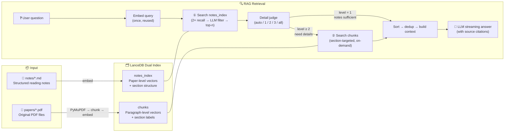

# Paper Vault

**Local paper reading assistant** — import PDFs, auto-generate structured notes, semantic search, adaptive RAG Q&A.

[](https://www.python.org/)
[](LICENSE)
[](README_zh.md)

---

## Why Paper Vault?

The most painful moments in academic research:

- **Read and forget**: can't recall the core formulas and methods from a paper you read three months ago
- **Paper silos**: each paper exists in isolation, with no automated way to connect them
- **Tool fragmentation**: PDFs in folders, notes in Obsidian, Q&A via ChatGPT — three disconnected workflows
- **No memory**: ChatGPT/Claude conversations lose all context when the session ends

Paper Vault solves all of this: **turn your PDFs into a queryable knowledge base, permanently stored and incrementally growing.**

### vs. ChatGPT / Claude / Claude Code

| | ChatGPT / Claude | Paper Vault |
|---|---|---|
| Paper library persistence | Lost after session | Permanent, continuously growing |
| Structured metadata | None | Title, authors, year, keywords |
| Batch processing | One paper at a time | Batch import, batch indexing |
| Data portability | Not exportable | Plain Markdown files, tool-agnostic |
| Reading notes | Manual prompting required | Auto-generated structured notes |
| Answer sourcing | Model memory / web search | Personal knowledge base retrieval, strict source tracing |
| API cost | Long context burns tokens | Retrieval + lightweight model, an order of magnitude cheaper |

Key differences:

- **Auto-generated notes, free your mind** — nothing breaks flow more than stopping to write notes while reading a paper. Paper Vault auto-generates structured notes on import (research question → method → implementation → results → formulas). You focus on reading; tweak the notes afterward. General AI tools require manual prompts every time, with inconsistent formatting and no persistence.
- **Knowledge-base RAG, not web search** — Claude Code and similar tools search the open web. Paper Vault's RAG retrieves from **your own paper library**. It's not for finding new things — it helps you **review, recall, and connect** papers you've already read. Every answer cites specific sources (which paper, which section), fully traceable.
- **Very low cost** — RAG constrains questions to retrieved paper excerpts, eliminating the need for massive context windows or complex reasoning. Lightweight models (e.g. DeepSeek-V4-Flash, GPT-4o-mini) work perfectly. A single Q&A costs a fraction of a cent, while general AI chat costs grow linearly with conversation length.

### vs. Obsidian / Notion

Paper Vault is **not a replacement for note-taking apps** — it fills the gap between them and paper reading:

| | Obsidian / Notion | Paper Vault |
|---|---|---|
| Paper note generation | Manual writing | Auto-generated structured notes |
| PDF handling | Plugins or external tools needed | Built-in PDF extraction + metadata detection |
| Semantic search | Relies on filenames/tags | 768-dim vector semantic search |
| AI integration | Requires plugin setup (e.g. Copilot), complex | Built-in RAG, works out of the box |
| Target use case | General note management | Paper knowledge base |
| Data format | Obsidian vault structure | Plain Markdown, directly openable in Obsidian |

Paper Vault and note-taking apps are **complementary**: Paper Vault handles paper import → note generation → indexing → semantic querying. The resulting notes are standard Markdown files, directly editable in Obsidian, VS Code, or any editor. Think of Paper Vault as the **ingestion and query layer** for your paper knowledge base, with note apps as the **deep editing and knowledge graph layer**.

Paper Vault's positioning: **lightweight, focused, runs in terminal or WebUI**. It doesn't replace note apps — it does what they don't: turning papers into searchable, queryable, long-term knowledge assets.

---

## Quick Start

### 1. Create environment

```bash
conda create -n papervault python=3.11 -c conda-forge -y
conda activate papervault
```

### 2. Install

```bash
pip install -e .
```

### 3. Configure API

```bash
cp .env.example .env
```

Edit `.env` with your LLM API key:

```env
OPENAI_BASE_URL=https://api.siliconflow.cn/v1
OPENAI_API_KEY=your-api-key-here
MODEL_ID=deepseek-ai/DeepSeek-V4-Flash
```

Paper Vault works with any OpenAI-compatible API endpoint (SiliconFlow, DeepSeek, OpenAI, Ollama, etc.).

It's also recommended to configure your paper source and note directories via the Web UI or `paper_vault/config.py`.

### 4. Import papers

```bash
# Place PDFs in ./papers/ (or your configured directory), then:
python pv.py import

# Or specify a file/directory
python pv.py import paper.pdf
python pv.py import ~/Downloads/my-papers/
```

On first run, the embedding model (~500MB) is downloaded. Subsequent starts use the cache. Users in China can set `HF_ENDPOINT=https://hf-mirror.com` in `.env` to speed up the download.

### 5. Launch Web UI

```bash
python pv.py serve
```

The browser opens automatically at `http://127.0.0.1:8080`. You can also double-click the launch scripts in the project root:

| File | Platform |
|------|----------|
| `start.command` | macOS — double-click in Finder |
| `start.bat` | Windows — double-click |
| `start.sh` | Linux — run in terminal |

---

## Features

### PDF Import → Structured Notes

Each PDF goes through three steps to become a readable note:

1. **Text extraction** — PyMuPDF extracts text in milliseconds, cached to `extracted/*.md`
2. **Metadata extraction** — LLM extracts title, authors, year, keywords
3. **Note generation** — LLM generates a structured note (research question → method → implementation → results → formulas)

Notes are saved as Markdown files with descriptive names (e.g. `AIF-SFDA_CVPR_2024.md`) and can be opened in any editor.

### Semantic Search

```bash
python pv.py search "domain adaptation"
python pv.py search "causal graph" -k 10
python pv.py search "segmentation" --year-from 2024 --author "Smith"
```

Supports year range and author filters.

### Adaptive RAG Q&A

```bash
# Basic question
python pv.py ask "What methods does AIF-SFDA use?"

# Comparative analysis
python pv.py ask "Compare the methods in these two papers" -n 10

# Full-text retrieval (large answers)
python pv.py ask "Survey of causal inference methods" -d all --max-tokens 4096

# Notes-only (fastest)
python pv.py ask "Give me a brief summary" -d 1

# Multi-turn conversation
python pv.py ask "What is the main contribution?" --session <id>
python pv.py ask "How does it compare to prior work?" --continue
```

The RAG pipeline includes **3-level adaptive depth judgment**:
- **Level 1 (notes only)** — overview questions, uses notes directly, fast and cheap
- **Level 2 (moderate)** — needs some detail, retrieves ~1/8 of paper chunks
- **Level 3 (extensive)** — needs deep detail, retrieves ~1/3 of paper chunks
- **all (full text)** — user-forced full text retrieval

The LLM auto-determines the question type; you can also override with `-d 1|2|3|all`.

### Web UI


- Browse all papers in the sidebar, load content on demand
- Drag-and-drop PDF upload with real-time progress streaming
- RAG Q&A panel with streaming output
- **Multi-turn conversation sessions** — chat-like interface with history, follow-up questions, progressive compaction
- Settings page (⚙) for paths, models, indexing, and RAG parameters
- Tab-based multi-panel — view notes and run Q&A simultaneously
- KaTeX math rendering, code highlighting, dark theme

### Other CLI Commands

```bash
python pv.py list                     # List all indexed papers
python pv.py remove <paper_id>        # Remove a paper
python pv.py fix-metadata <paper_id>  # Re-extract metadata
python pv.py fix-metadata --all       # Fix metadata for all papers
python pv.py import --no-llm          # Extract text only, skip LLM
python pv.py import --force           # Force re-import (ignore content hash)

# Multi-turn conversation sessions
python pv.py session new              # Create a new session
python pv.py session list             # List all sessions
python pv.py session show <id>        # Show session details
python pv.py session delete <id>      # Delete a session
python pv.py ask "your question" --session <id>   # Ask within a session
python pv.py ask "follow-up" --continue           # Continue the most recent session
```

---

## Architecture



**Key design decisions:**

- **Dual-model strategy** — lightweight model handles metadata/judge/section matching; primary model used only for note generation and final answers, maximizing cost efficiency
- **LLM-only metadata extraction** — clean and reliable, ~$0.0003 per paper, no heuristic rule maintenance burden
- **Content-hash deduplication** — identical PDFs with different filenames are automatically skipped
- **Embedding reuse** — question embedding computed once and shared across search/filter/chunk retrieval
- **Section-targeted retrieval** — LLM matches questions to relevant sections, avoiding full-text scanning
- **Dual-index complement** — notes_index provides paper-level overview; chunks_index provides formula/implementation-level detail
- **Source traceability** — every chunk and note carries source labels; answers cite specific papers

---

## Token Cost & Model Selection

Paper Vault's API cost comes from two LLM tiers. Embeddings run entirely locally at zero cost.

### Model Recommendations

RAG Q&A is fundamentally about synthesizing retrieved information — **lightweight models (e.g. DeepSeek-V4-Flash, GPT-4o-mini) are sufficient**. Note generation, which requires understanding a full paper and producing structured output, benefits from a slightly stronger model. The choice comes down to your **speed vs. quality** preference:

- Speed-focused: use Flash-level models for both primary and lightweight, sub-2s Q&A
- Quality-focused: use DeepSeek-V4 / GPT-4o for note generation, Flash for Q&A

### Cost Reference

Estimated with DeepSeek official API pricing (domestic providers like SiliconFlow are typically cheaper):

| Operation | Approx. cost |
|-----------|-------------|
| Import one paper (metadata + note generation) | ¥0.01 ~ 0.02 |
| One RAG Q&A (adaptive depth) | ¥0.002 ~ 0.01 |
| Embedding (768-dim, local CPU) | ¥0 |

### Cost-saving Tips

- **Set `LIGHT_MODEL_ID`** — use cheap fast models for metadata extraction, RAG judge, and section matching; the primary model only handles note generation and final answers
- **Embeddings are free** — multilingual-e5-base runs locally, zero API cost
- **Import once, query forever** — notes and vector indexes are persistent; repeated queries incur no additional import costs

> All API calls are tracked. The CLI prints and the Web UI toolbar shows `[Usage] N calls, X in + Y out = Z tokens` after each operation.

---

## Configuration

### Environment variables (`.env`)

| Variable | Default | Description |
|----------|---------|-------------|
| `OPENAI_BASE_URL` | — | OpenAI-compatible API endpoint |
| `OPENAI_API_KEY` | — | API key |
| `MODEL_ID` | — | Primary model (note generation, RAG answers) |
| `LIGHT_MODEL_ID` | Same as `MODEL_ID` | Lightweight model (metadata, judge, section matching) |
| `EMBEDDING_MODEL` | `intfloat/multilingual-e5-base` | Local embedding model |
| `PAPER_VAULT_DIR` | `./vault` | Vault root directory |
| `PAPER_VAULT_IMPORT_DIRS` | `./papers` | Default PDF scan paths (`:` separated) |
| `PAPER_VAULT_MAX_PDF_MB` | Unlimited | PDF size limit |
| `PAPER_VAULT_MAX_UPLOAD_MB` | `100` | Web upload size limit |
| `PAPER_VAULT_CHUNK_SIZE` | `800` | Text chunk size (chars) |
| `PAPER_VAULT_CHUNK_OVERLAP` | `100` | Chunk overlap (chars) |
| `PAPER_VAULT_NOTE_GEN_TEMPERATURE` | `0.3` | Note generation LLM temperature |
| `PAPER_VAULT_RAG_QA_TEMPERATURE` | `0.3` | RAG answer LLM temperature |

More parameters (RAG chunk divisors, answer token tiers, etc.) can be configured via the Web UI Settings page (⚙) or environment variables. See `config.py` for details.

### settings.json

Settings saved via the Web UI are stored in `vault/settings.json`. Priority: **environment variables > settings.json > code defaults**. Path and model changes require a restart.

---

## Vault Directory Structure

```
./vault/
├── extracted/       # Cached raw text extracted from PDFs (.md)
├── notes/           # LLM-generated structured reading notes (.md)
├── sessions/        # Multi-turn conversation session files (.json)
├── models/          # HuggingFace embedding model cache (~500MB)
├── vectors/         # LanceDB vector database
└── settings.json    # Web UI persisted settings
```

All data is plain text. Notes can be opened and edited in Obsidian, VS Code, or any editor — no lock-in.

---

## Tech Stack

| Component | Choice | Rationale |
|-----------|--------|-----------|
| PDF extraction | PyMuPDF | Millisecond extraction, 1000× faster than Marker |
| Embedding model | multilingual-e5-base | Bilingual (EN/ZH), 768-dim, local, zero API cost |
| Vector database | LanceDB | Embedded, zero-config, deep PyArrow integration |
| LLM client | OpenAI SDK | Compatible with any OpenAI-format API |
| Web framework | FastAPI + Uvicorn | Lightweight, high-performance, single-file deployment |
| Frontend | Vanilla JS + marked.js + KaTeX | Zero build steps, CDN-loaded |
| Config management | .env + JSON | Secrets isolation, Web UI friendly |
| Package management | pip + pyproject.toml | Standard ecosystem, `pip install -e .` |

---

## Design Philosophy

- **Local-first** — all data stored locally, embeddings run locally, no cloud dependency (except LLM API)
- **Plain text** — notes are standard Markdown, no data format lock-in
- **Simplicity first** — CLI before GUI, single-file deployment before microservices
- **Incremental & irreversible** — import persists immediately, deletion requires explicit action, no silent overwrites
- **Cost-controlled** — dual-model strategy minimizes API calls, embeddings are free

---

## Roadmap

- [x] PDF import & text extraction
- [x] LLM structured note generation
- [x] Vector indexing & semantic search
- [x] Metadata extraction & filtered search
- [x] Adaptive RAG Q&A (3-level judge)
- [x] Token usage tracking
- [x] Web UI (FastAPI + single HTML)
- [x] Content-hash deduplication
- [x] Settings configuration page
- [x] Native folder picker
- [x] Web UI cancel/interrupt support
- [x] Double-click launch scripts (macOS / Windows / Linux)
- [ ] Paper relationship graph
- [x] Multi-turn conversation sessions
- [ ] Token budget control

---

## Further Reading

See [IMPLEMENTATION.md](IMPLEMENTATION.md) (implementation details, design decisions, known issues).

## License

MIT
