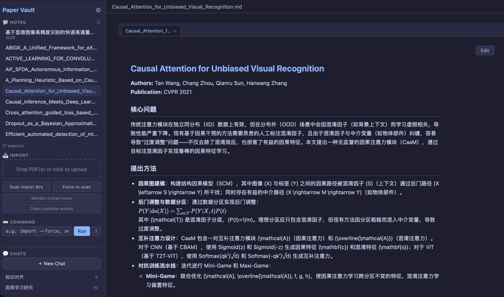
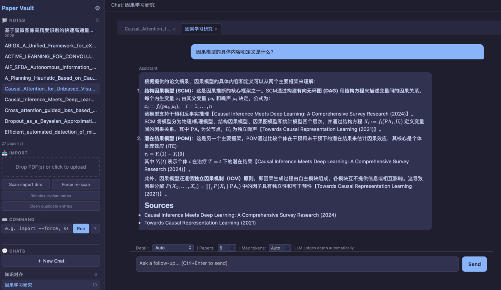
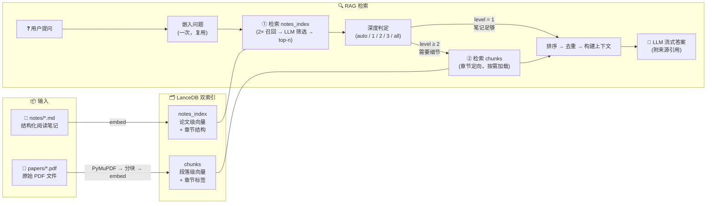

# Paper Vault

**本地论文阅读助手** — 导入 PDF，自动生成结构化笔记，语义搜索，自适应 RAG 问答。

[](https://www.python.org/)
[](LICENSE)
[](README.md)





---

## 为什么需要 Paper Vault？

学术研究中最痛苦的几个瞬间：

- **读过就忘**：三个月前精读的论文，回想不起核心公式和方法
- **论文孤岛**：每篇论文独立存在，缺少自动化的关联手段
- **工具割裂**：PDF 在文件夹、笔记在 Obsidian、问答靠 ChatGPT，三者各说各话
- **对话无记忆**：ChatGPT/Claude 对话结束上下文就丢失，不会记住你的知识库

Paper Vault 解决的就是这个：**把你的 PDF 变成可对话的知识库，永久存储，增量积累。**

### vs. ChatGPT / Claude / Claude Code

| | ChatGPT / Claude | Paper Vault |
|---|---|---|
| 论文库持久化 | 对话结束即丢失 | 永久存储，持续积累 |
| 结构化元数据 | 无 | 标题、作者、年份、关键词 |
| 批量处理 | 逐篇对话 | 批量导入、批量索引 |
| 数据可迁移 | 不可导出 | 纯 Markdown 文件，工具无关 |
| 阅读笔记 | 需手动 prompt | 自动生成结构化中文笔记 |
| 问答来源 | 模型记忆/网络搜索 | 个人知识库检索，严格来源追溯 |
| API 成本 | 长上下文消耗大量 token | 检索 + 轻量模型即可，成本低一个数量级 |

核心差异：

- **自动生成笔记，解放大脑** — 读论文时最打断心流的事就是停下来整理笔记。Paper Vault 在导入时自动生成结构化中文笔记（研究问题 → 方法 → 实现 → 结果 → 公式），你只需专注阅读，读完微调笔记即可。通用 AI 工具每次都需要手动写 prompt 要求摘要，且格式不统一、无法持久化。
- **基于知识库的 RAG，非网络搜索** — Claude Code 等工具的搜索能力面向网络开放信息，而 Paper Vault 的 RAG 检索的是**你自己的论文库**。它的作用不是帮你搜新东西，而是帮你**复习、回忆、关联**已经读过的论文，每个回答都附带具体来源引用（哪篇论文、哪个章节），可追溯验证。
- **成本极低** — RAG 将问题限定在已检索的论文片段内，不需要大模型的海量上下文窗口和复杂推理。轻量模型（如 DeepSeek-V4-Flash）即可胜任，一次问答花费几分钱甚至更低，而通用 AI 的长对话上下文成本随对话线性增长。

### vs. Obsidian / Notion 等笔记软件

Paper Vault **不旨在替代笔记软件**，而是填补它们与论文阅读之间的空白：

| | Obsidian / Notion | Paper Vault |
|---|---|---|
| 论文笔记生成 | 手动编写 | 自动生成结构化笔记 |
| PDF 处理 | 需插件或外部工具 | 内置 PDF 提取 + 元数据识别 |
| 语义检索 | 依赖文件名/标签/tag | 768 维向量语义搜索 |
| AI 接入 | 需配置插件（如 Copilot），步骤繁琐 | 内置 RAG，开箱即用 |
| 目标场景 | 通用笔记管理 | 专注论文知识库 |
| 数据格式 | Obsidian 自有 vault 结构 | 纯 Markdown 文件，可被 Obsidian 直接打开 |

Paper Vault 与笔记软件是**互补关系**：Paper Vault 负责论文导入 → 笔记生成 → 索引构建 → 语义查询，生成的笔记是标准 Markdown 文件，可直接用 Obsidian、VS Code 等工具打开编辑。你可以把 Paper Vault 视为论文知识库的**入库层和查询层**，笔记软件作为**深度编辑和知识图谱层**。

Paper Vault 的定位：**轻量、专注、终端/WebUI 即可运行**，不替代笔记软件，只解决它们没做好的事——把论文变成可检索、可问答的长期知识资产。

---

## 快速开始

### 1. 创建环境

```bash
conda create -n papervault python=3.11 -c conda-forge -y
conda activate papervault
```

### 2. 安装

```bash
pip install -e .
```

### 3. 配置 API

```bash
cp .env.example .env
```

编辑 `.env`，填入你的 LLM API Key：

```env
OPENAI_BASE_URL=https://api.siliconflow.cn/v1
OPENAI_API_KEY=your-api-key-here
MODEL_ID=deepseek-ai/DeepSeek-V4-Flash
```

Paper Vault 兼容任何 OpenAI 格式的 API 端点（SiliconFlow、DeepSeek、OpenAI、Ollama 等）。

此外强烈建议通过后续的 WEB UI 或者在 paper_vault/config.py 文件中配置你的论文来源，笔记存放地址
### 4. 导入论文

```bash
# 将 PDF 放入 ./papers/ 目录或config配置的目录，然后：
python pv.py import

# 或指定文件/目录
python pv.py import paper.pdf
python pv.py import ~/Downloads/my-papers/
```

首次运行会下载嵌入模型（~500MB），后续启动直接使用缓存。国内用户可在 `.env` 中设置 `HF_ENDPOINT=https://hf-mirror.com` 加速下载。

### 5. 启动 Web UI

```bash
python pv.py serve
```

浏览器自动打开 `http://127.0.0.1:8080`。也可以直接双击项目根目录的启动脚本：

| 文件 | 平台 |
|------|------|
| `start.command` | macOS — Finder 双击 |
| `start.bat` | Windows — 双击运行 |
| `start.sh` | Linux — 终端执行 |

---

## 功能概览

### 📄 PDF 导入 → 结构化笔记

每篇 PDF 经过三个步骤变成可读的阅读笔记：

1. **文本提取** — PyMuPDF 毫秒级提取，缓存为 `extracted/*.md`
2. **元数据提取** — LLM 提取标题、作者、年份、关键词
3. **笔记生成** — LLM 生成结构化中文笔记（研究问题 → 方法 → 实现 → 结果 → 公式）

笔记保存为 Markdown 文件，文件名包含标题和来源（如 `AIF-SFDA_CVPR_2024.md`），可用任何编辑器打开和修改。

### 🔍 语义搜索

```bash
python pv.py search "domain adaptation"
python pv.py search "causal graph" -k 10
python pv.py search "segmentation" --year-from 2024 --author "Smith"
```

支持年份范围和作者筛选。

### 💬 自适应 RAG 问答

```bash
# 基础提问
python pv.py ask "What methods does AIF-SFDA use?"

# 对比分析
python pv.py ask "比较两篇论文的方法" -n 10

# 全文检索（大型回答）
python pv.py ask "因果推断综述" -d all --max-tokens 4096

# 仅基于笔记回答（最快）
python pv.py ask "简要总结" -d 1

# 多轮对话
python pv.py ask "这篇论文的主要贡献是什么？" --session <id>
python pv.py ask "和已有工作相比如何？" --continue
```

RAG 管道包含 **3 级自适应深度判断**：
- **Level 1 (notes only)** — 概括性问题，直接用笔记回答，快速省钱
- **Level 2 (moderate)** — 需要一定细节，检索 ~1/8 的论文片段
- **Level 3 (extensive)** — 需要深入细节，检索 ~1/3 的论文片段
- **all (full text)** — 用户强制全文检索

LLM 自动判断问题类型，也可手动 `-d 1|2|3|all` 覆盖。

### 🌐 Web UI


- 左侧目录浏览所有论文，按需加载内容
- 拖拽 PDF 上传，实时进度流
- RAG 问答面板，流式输出
- **多轮对话会话** — 聊天式界面，支持追问和历史回放，渐进式压缩
- 设置页（⚙）可配置路径、模型、索引参数、RAG 参数
- Tab 多面板 — 同时查看笔记和进行问答
- KaTeX 公式渲染、代码高亮、暗色主题

### 🛠 其他 CLI 命令

```bash
python pv.py list                     # 列出所有已索引论文
python pv.py remove <paper_id>        # 移除论文
python pv.py fix-metadata <paper_id>  # 重新提取元数据
python pv.py fix-metadata --all       # 修复所有论文元数据
python pv.py import --no-llm          # 仅提取文本，跳过 LLM
python pv.py import --force           # 强制重新导入（覆盖已有内容哈希）

# 多轮对话会话
python pv.py session new              # 创建新会话
python pv.py session list             # 列出所有会话
python pv.py session show <id>        # 查看会话详情
python pv.py session delete <id>      # 删除会话
python pv.py ask "你的问题" --session <id>   # 在指定会话中提问
python pv.py ask "追问" --continue           # 继续最近的会话
```

---

## 架构



**关键设计：**

- **双模型策略** — 轻量模型处理元数据/judge/章节匹配，主模型仅用于笔记生成和最终回答，最大化性价比
- **纯 LLM 元数据提取** — 简洁可靠，单篇成本 ~$0.0003，免去启发式规则维护负担
- **内容哈希去重** — 相同内容的 PDF 用不同文件名导入时自动跳过
- **嵌入复用** — 问题嵌入在整个管道中计算一次，搜索/筛选/chunk 检索共用
- **章节定向检索** — LLM 将问题匹配到相关章节，避免全文扫描
- **双索引互补** — notes_index 提供论文级概览，chunks_index 提供公式/实现细节级检索
- **来源可追溯** — 每个 chunk 和 note 携带来源标签，答案引用具体论文

---

## Token 花费与模型选择

Paper Vault 的 API 花费来自两个 LLM 层级，嵌入模型完全本地运行，零费用。

### 模型建议

RAG 问答的本质是基于检索到的信息进行归纳整合，**轻量模型（如 DeepSeek-V4-Flash、GPT-4o-mini）已足够胜任**。笔记生成由于需要理解全文并组织结构化输出，建议使用稍强的模型。选择取决于你对**速度 vs 质量**的取舍：

- 追求速度：主模型和轻量模型都用 Flash 级别，一次问答 < 2 秒
- 追求质量：笔记生成用 DeepSeek-V4 / GPT-4o，问答仍可用 Flash

### 花费参考

按 DeepSeek 官方 API 价格估算（国产代理如 SiliconFlow 通常更便宜）：

| 操作 | 花费（约） |
|------|----------|
| 导入一篇论文（元数据 + 笔记生成） | ¥0.01 ~ 0.02 |
| 一次 RAG 问答（自适应深度） | ¥0.002 ~ 0.01 |
| 嵌入（768 维，本地 CPU） | ¥0 |

### 省钱要点

- **设置 `LIGHT_MODEL_ID`** — 元数据提取、RAG judge、章节匹配等高频小请求用廉价模型，主模型仅用于笔记生成和最终回答
- **嵌入完全免费** — multilingual-e5-base 在本地运行，不产生任何 API 费用
- **一次导入，永久复用** — 笔记和向量索引持久存储，重复提问不产生额外导入费用

> 所有 API 调用均有 token 统计，CLI 每次操作结束和 Web UI 工具栏均显示 `[Usage] N calls, X in + Y out = Z tokens`。

---

## 配置

### 环境变量 (`.env`)

| 变量 | 默认值 | 说明 |
|------|--------|------|
| `OPENAI_BASE_URL` | — | OpenAI 兼容 API 端点 |
| `OPENAI_API_KEY` | — | API 密钥 |
| `MODEL_ID` | — | 主模型（笔记生成、RAG 回答） |
| `LIGHT_MODEL_ID` | 同 `MODEL_ID` | 轻量模型（元数据、judge、章节匹配） |
| `EMBEDDING_MODEL` | `intfloat/multilingual-e5-base` | 本地嵌入模型 |
| `PAPER_VAULT_DIR` | `./vault` | Vault 根目录 |
| `PAPER_VAULT_IMPORT_DIRS` | `./papers` | 默认 PDF 扫描路径（`:` 分隔多个） |
| `PAPER_VAULT_MAX_PDF_MB` | 不限 | PDF 大小限制 |
| `PAPER_VAULT_MAX_UPLOAD_MB` | `100` | Web 上传大小限制 |
| `PAPER_VAULT_CHUNK_SIZE` | `800` | 文本分块大小（字符） |
| `PAPER_VAULT_CHUNK_OVERLAP` | `100` | 分块重叠（字符） |
| `PAPER_VAULT_NOTE_GEN_TEMPERATURE` | `0.3` | 笔记生成 LLM 温度 |
| `PAPER_VAULT_RAG_QA_TEMPERATURE` | `0.3` | RAG 回答 LLM 温度 |

更多参数（RAG chunk 除数、answer token 分层等）可在 Web UI Settings 页面（⚙）配置，或通过环境变量设置。详见 `config.py`。

### settings.json

Web UI 的 Settings 页面保存的配置存储在 `vault/settings.json`。优先级：**环境变量 > settings.json > 代码默认值**。路径和模型修改后需重启服务。

---

## Vault 目录结构

```
./vault/
├── extracted/       # PDF 提取的原始文本缓存 (.md)
├── notes/           # LLM 生成的结构化阅读笔记 (.md)
├── sessions/        # 多轮对话会话文件 (.json)
├── models/          # HuggingFace 嵌入模型缓存 (~500MB)
├── vectors/         # LanceDB 向量数据库
└── settings.json    # Web UI 持久化配置
```

所有数据均为纯文本格式。笔记可用 Obsidian、VS Code 等编辑器直接打开修改，不依赖 Paper Vault。

---

## 技术栈

| 组件 | 选型 | 理由 |
|------|------|------|
| PDF 提取 | PyMuPDF | 毫秒级，比 Marker 快 1000× |
| 嵌入模型 | multilingual-e5-base | 中英双语，768-dim，本地运行零 API 费用 |
| 向量数据库 | LanceDB | 嵌入式，零配置，与 PyArrow 深度集成 |
| LLM 客户端 | OpenAI SDK | 兼容任何 OpenAI 格式 API |
| Web 框架 | FastAPI + Uvicorn | 轻量高性能，单文件部署 |
| 前端 | Vanilla JS + marked.js + KaTeX | 零构建步骤，CDN 加载 |
| 配置管理 | .env + JSON | 敏感信息隔离，Web UI 友好 |
| 包管理 | pip + pyproject.toml | 标准生态，`pip install -e .` 即可 |

---

## 设计哲学

- **本地优先** — 所有数据存本地，嵌入在本地运行，不依赖云服务（LLM API 除外）
- **纯文本** — 笔记是标准 Markdown，不锁定数据格式
- **简单至上** — CLI 优先于 GUI，单文件部署优先于微服务
- **增量不可逆** — 导入即持久化，删除需显式操作，不静默覆盖
- **成本可控** — 双模型策略最小化 API 调用，嵌入完全免费

---

## 路线图

- [x] PDF 导入与文本提取
- [x] LLM 结构化笔记生成
- [x] 向量索引与语义搜索
- [x] 元数据提取与筛选搜索
- [x] 自适应 RAG 问答（3 级 judge）
- [x] Token 使用追踪
- [x] Web UI（FastAPI + 单 HTML）
- [x] 内容哈希去重
- [x] Settings 配置页面
- [x] 原生文件夹选择器
- [x] Web UI 取消/中断支持
- [x] 双击启动脚本（macOS / Windows / Linux）
- [ ] 论文关系图谱
- [x] 多轮对话 Session
- [ ] Token 预算控制

---

## 技术文档

详见 [IMPLEMENTATION.md](IMPLEMENTATION.md)（实现细节、设计决策、已知问题）。

## License

MIT
